# JobKorea Billboard - Entity Relationship Diagram (ERD)

## 데이터베이스 구조 다이어그램

```mermaid
erDiagram
    %% 사용자 관련 테이블
    USERS {
        int id PK
        varchar username UK
        varchar email UK
        varchar password_hash
        varchar full_name
        varchar phone
        varchar profile_image
        enum role
        enum status
        boolean email_verified
        text bio
        varchar location
        varchar website
        timestamp last_login
        timestamp created_at
        timestamp updated_at
    }

    FREELANCERS {
        int id PK
        int user_id UK,FK
        varchar title
        text description
        json skills
        int experience_years
        enum experience_level
        decimal hourly_rate
        enum availability
        enum preferred_work_type
        varchar portfolio_url
        varchar github_url
        varchar linkedin_url
        decimal rating
        int total_reviews
        int completed_projects
        boolean is_verified
        timestamp verification_date
        timestamp created_at
        timestamp updated_at
    }

    COMPANIES {
        int id PK
        int user_id FK
        varchar name
        text description
        varchar industry
        enum company_size
        int founded_year
        varchar website
        varchar location
        text address
        varchar logo_url
        varchar cover_image
        boolean is_verified
        enum status
        timestamp created_at
        timestamp updated_at
    }

    %% 프로젝트 관련 테이블
    PROJECTS {
        int id PK
        varchar title
        text description
        varchar category
        varchar subcategory
        enum budget_type
        decimal budget_min
        decimal budget_max
        varchar currency
        enum duration_type
        int duration_value
        date start_date
        date deadline
        enum work_type
        enum experience_level
        json required_skills
        json optional_skills
        int client_id FK
        int company_id FK
        enum status
        enum priority
        int views
        int applications_count
        boolean is_featured
        boolean is_urgent
        timestamp created_at
        timestamp updated_at
    }

    PROJECT_APPLICATIONS {
        int id PK
        int project_id FK
        int freelancer_id FK
        text cover_letter
        decimal proposed_budget
        varchar proposed_timeline
        json portfolio_items
        enum status
        text client_notes
        timestamp applied_at
        timestamp updated_at
    }

    %% 채용 관련 테이블
    JOB_POSTINGS {
        int id PK
        varchar title
        text description
        varchar department
        enum position_level
        enum employment_type
        enum work_type
        enum salary_type
        decimal salary_min
        decimal salary_max
        varchar currency
        boolean salary_negotiable
        varchar location
        text address
        json required_skills
        json preferred_skills
        enum education_level
        int experience_years_min
        int experience_years_max
        json benefits
        int company_id FK
        int recruiter_id FK
        date application_deadline
        date start_date
        enum status
        int views
        int applications_count
        boolean is_featured
        boolean is_urgent
        timestamp created_at
        timestamp updated_at
    }

    %% 콘텐츠 관련 테이블
    BLOG_POSTS {
        int id PK
        varchar title
        varchar slug UK
        longtext content
        text excerpt
        varchar category
        varchar subcategory
        json tags
        int author_id FK
        varchar featured_image
        enum status
        int views
        int likes
        int comments_count
        int shares
        varchar meta_title
        text meta_description
        boolean is_featured
        boolean allow_comments
        timestamp published_at
        timestamp created_at
        timestamp updated_at
    }

    COMMUNITY_POSTS {
        int id PK
        varchar title
        text content
        enum category
        int author_id FK
        json attachments
        json images
        enum status
        int views
        int likes
        int dislikes
        int comments_count
        boolean is_pinned
        boolean is_locked
        boolean is_anonymous
        timestamp created_at
        timestamp updated_at
    }

    COMMENTS {
        int id PK
        text content
        int post_id
        enum post_type
        int author_id FK
        int parent_id FK
        int depth
        enum status
        int likes
        int dislikes
        boolean is_anonymous
        timestamp created_at
        timestamp updated_at
    }

    %% 평가 및 포트폴리오
    REVIEWS {
        int id PK
        int project_id FK
        int reviewer_id FK
        int reviewee_id FK
        varchar title
        text content
        decimal overall_rating
        decimal communication_rating
        decimal quality_rating
        decimal timeline_rating
        enum review_type
        enum status
        boolean is_public
        timestamp created_at
        timestamp updated_at
    }

    PORTFOLIOS {
        int id PK
        int user_id FK
        varchar title
        text description
        varchar category
        json technologies
        varchar role
        varchar project_url
        varchar github_url
        varchar demo_url
        json images
        varchar video_url
        varchar client_name
        varchar project_duration
        int team_size
        json achievements
        json metrics
        enum status
        boolean is_featured
        int display_order
        date completion_date
        timestamp created_at
        timestamp updated_at
    }

    %% 커뮤니케이션 관련
    MESSAGES {
        int id PK
        int sender_id FK
        int receiver_id FK
        varchar subject
        text content
        int project_id FK
        int job_id FK
        enum message_type
        varchar thread_id
        int parent_id FK
        enum status
        boolean is_read
        timestamp read_at
        json attachments
        timestamp created_at
        timestamp updated_at
    }

    NOTIFICATIONS {
        int id PK
        int user_id FK
        varchar title
        text message
        enum type
        enum priority
        varchar reference_type
        int reference_id
        varchar action_url
        boolean is_read
        timestamp read_at
        boolean send_email
        boolean send_push
        timestamp created_at
    }

    %% 시스템 관련
    USER_SESSIONS {
        varchar id PK
        int user_id FK
        varchar ip_address
        text user_agent
        enum device_type
        varchar browser
        varchar os
        varchar country
        varchar city
        boolean is_active
        timestamp last_activity
        timestamp expires_at
        timestamp created_at
    }

    FILE_UPLOADS {
        int id PK
        varchar filename
        varchar original_name
        varchar file_path
        bigint file_size
        varchar mime_type
        varchar file_extension
        int uploader_id FK
        enum entity_type
        int entity_id
        enum file_category
        int width
        int height
        enum status
        timestamp created_at
    }

    TAGS {
        int id PK
        varchar name UK
        varchar slug UK
        text description
        varchar color
        int usage_count
        enum category
        timestamp created_at
        timestamp updated_at
    }

    SEARCH_LOGS {
        int id PK
        int user_id FK
        varchar search_query
        enum search_type
        json filters
        int results_count
        int clicked_result_id
        int click_position
        varchar ip_address
        text user_agent
        timestamp created_at
    }

    SYSTEM_SETTINGS {
        int id PK
        varchar setting_key UK
        text setting_value
        enum setting_type
        text description
        varchar category
        timestamp created_at
        timestamp updated_at
    }

    AUDIT_LOGS {
        bigint id PK
        int user_id FK
        varchar table_name
        enum operation
        int record_id
        json old_values
        json new_values
        varchar ip_address
        text user_agent
        timestamp created_at
    }

    %% 관계 정의
    USERS ||--o{ FREELANCERS : "has_freelancer_profile"
    USERS ||--o{ COMPANIES : "manages_company"
    USERS ||--o{ PROJECTS : "creates_projects"
    USERS ||--o{ PROJECT_APPLICATIONS : "applies_to_projects"
    USERS ||--o{ JOB_POSTINGS : "posts_jobs"
    USERS ||--o{ BLOG_POSTS : "writes_blogs"
    USERS ||--o{ COMMUNITY_POSTS : "writes_community_posts"
    USERS ||--o{ COMMENTS : "writes_comments"
    USERS ||--o{ REVIEWS : "writes_reviews"
    USERS ||--o{ REVIEWS : "receives_reviews"
    USERS ||--o{ PORTFOLIOS : "owns_portfolios"
    USERS ||--o{ MESSAGES : "sends_messages"
    USERS ||--o{ MESSAGES : "receives_messages"
    USERS ||--o{ NOTIFICATIONS : "receives_notifications"
    USERS ||--o{ USER_SESSIONS : "has_sessions"
    USERS ||--o{ FILE_UPLOADS : "uploads_files"
    USERS ||--o{ SEARCH_LOGS : "performs_searches"
    USERS ||--o{ AUDIT_LOGS : "audit_tracked"

    COMPANIES ||--o{ PROJECTS : "sponsors_projects"
    COMPANIES ||--o{ JOB_POSTINGS : "posts_jobs"

    PROJECTS ||--o{ PROJECT_APPLICATIONS : "receives_applications"
    PROJECTS ||--o{ REVIEWS : "reviewed_after_completion"
    PROJECTS ||--o{ MESSAGES : "project_communications"

    JOB_POSTINGS ||--o{ MESSAGES : "job_inquiries"

    BLOG_POSTS ||--o{ COMMENTS : "has_blog_comments"
    COMMUNITY_POSTS ||--o{ COMMENTS : "has_community_comments"

    COMMENTS ||--o{ COMMENTS : "has_replies"

    MESSAGES ||--o{ MESSAGES : "message_threads"
```

## 주요 테이블 설명

### 🔑 핵심 엔티티

#### 1. USERS (사용자)
- 시스템의 모든 사용자 정보
- 프리랜서, 클라이언트, 관리자 역할 구분
- 인증 및 프로필 정보 관리

#### 2. FREELANCERS (프리랜서)
- 프리랜서 전문 정보 및 포트폴리오
- 기술 스택, 경력, 평점 관리
- 사용자와 1:1 관계

#### 3. COMPANIES (회사)
- 기업 정보 및 인증 관리
- 프로젝트 등록 및 채용 공고 주체

### 💼 비즈니스 엔티티

#### 4. PROJECTS (프로젝트)
- 프리랜서 매칭 프로젝트
- 예산, 기간, 기술 요구사항 관리
- 지원자 관리 및 매칭

#### 5. PROJECT_APPLICATIONS (프로젝트 지원)
- 프리랜서의 프로젝트 지원 정보
- 제안서, 예산, 일정 관리

#### 6. JOB_POSTINGS (채용공고)
- 정규직/계약직 채용 정보
- 급여, 복리후생, 요구사항 관리

### 📝 콘텐츠 엔티티

#### 7. BLOG_POSTS (블로그)
- 기술 블로그 및 칼럼
- 카테고리별 분류 및 SEO 최적화

#### 8. COMMUNITY_POSTS (커뮤니티)
- 자유게시판, Q&A, 스터디 모집
- 다양한 카테고리 지원

#### 9. COMMENTS (댓글)
- 블로그, 커뮤니티 댓글 시스템
- 대댓글 구조 지원

### ⭐ 평가 및 신뢰도

#### 10. REVIEWS (리뷰)
- 프로젝트 완료 후 상호 평가
- 다차원 평점 시스템 (소통, 품질, 일정)

#### 11. PORTFOLIOS (포트폴리오)
- 프리랜서 작품 및 경력 관리
- 기술 스택 및 성과 지표

### 💬 커뮤니케이션

#### 12. MESSAGES (메시지)
- 사용자 간 직접 메시지
- 프로젝트/채용 관련 문의
- 스레드 구조 지원

#### 13. NOTIFICATIONS (알림)
- 시스템 알림 관리
- 이메일/푸시 알림 설정

### 🔧 시스템 관리

#### 14. USER_SESSIONS (세션)
- 사용자 로그인 세션 관리
- 디바이스 및 위치 정보

#### 15. FILE_UPLOADS (파일)
- 프로필 이미지, 포트폴리오 첨부파일
- 다양한 엔티티와 연관

#### 16. AUDIT_LOGS (감사로그)
- 데이터 변경 이력 추적
- 보안 및 규정 준수

## 🔗 주요 관계

### 1:1 관계
- USERS ↔ FREELANCERS (사용자당 하나의 프리랜서 프로필)

### 1:N 관계
- USERS → PROJECTS (사용자가 여러 프로젝트 등록)
- USERS → PORTFOLIOS (사용자가 여러 포트폴리오 소유)
- PROJECTS → PROJECT_APPLICATIONS (프로젝트당 여러 지원자)
- USERS → COMMENTS (사용자가 여러 댓글 작성)

### N:N 관계
- USERS ↔ REVIEWS (상호 평가 관계)
- PROJECTS ↔ TAGS (프로젝트별 여러 태그)

## 🎯 설계 특징

### 성능 최적화
- 검색 빈도가 높은 컬럼에 인덱스 설정
- FULLTEXT 인덱스로 검색 성능 향상
- JSON 컬럼으로 유연한 데이터 구조

### 보안 및 감사
- 민감한 정보 별도 뷰 처리
- 사용자별 권한 분리 (읽기전용, 앱용, 백업용)
- 모든 중요 작업에 대한 감사 로그

### 확장성
- 소프트 삭제 방식으로 데이터 보존
- 모듈별 테이블 분리로 기능 확장 용이
- JSON 컬럼으로 스키마 유연성 확보